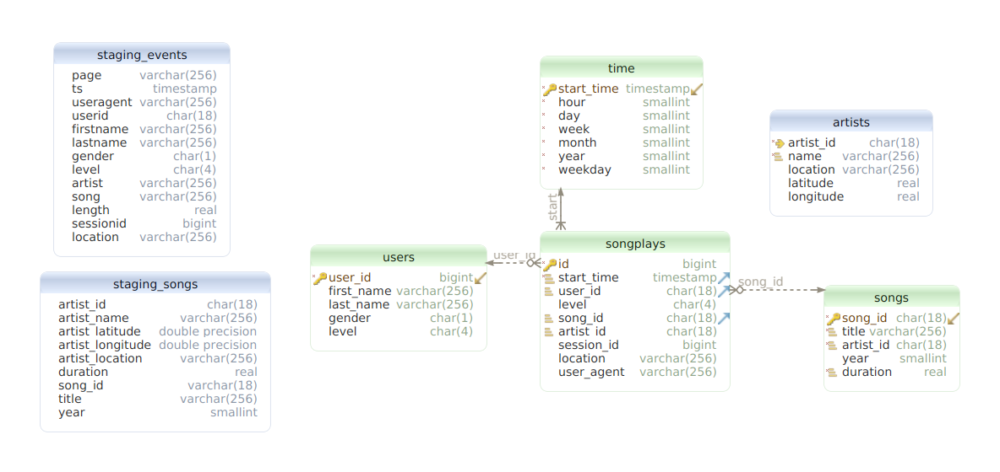

# Project: Data Warehouse

## Introduction
A music streaming startup, Sparkify, has grown their user base and song database and want to move their processes and data onto the cloud. Their data resides in S3, in a directory of JSON logs on user activity on the app, as well as a directory with JSON metadata on the songs in their app.

## Database design

### ER diagram


### Fact Table
Songplays - records in event data associated with song plays i.e. records with page NextSong
- fields: songplay_id, start_time, user_id, level, song_id, artist_id, session_id, location, user_agent 
- interleaved sort key based on start_time, user_id, song_id, artist_id

Sort key should speed up joins to the dimensions tables. 
And as most likely analytics query can have different use different joins it's ideal case for interleaved sort key

### Dimension Tables
1) Users - users in the app
- fields: user_id, first_name, last_name, gender, level.
This table has a distkey and a sortkey based on user_id to speed up join clause. 

2) Songs - songs in music database
- fields: song_id, title, artist_id, year, duration
- distkey - song_id 
- interleaved sortkey based on song_id, title, artist_id, duration. 

The sort key speeds up inserting new data songplays (that join data based on title, artist_id, duration) and joins based on song_id.

3) artists - artists in music database
- fields: artist_id, name, location, lattitude, longitude
- distkey - artist_id
- compound sortkey based on artist_id, name. Sortkey speeds up insert/joins

As you see from the diagram that this table doesn't have a PK. 
That's because this table has duplicates.  
That's because to set artist/song ids in fact table we need to retrieve it from song/artist table based 
on exact match between song title, song duration and artist name in artists/songs and staging_song tables.  
And according to the dataset we can have artists with same id but with different names.

For example:
- id=1, name=Beyonce
- id=1, name=Beyonce Experience

These entries represent same artist but with different names. And there are 2 choices how to handle this case 
- allow duplication
- use snowlake schema

As second option will degrade performance as db will execute another join it's better to use duplicates 

5) time - timestamps of records in songplays broken down into specific units
- fields: start_time, hour, day, week, month, year, weekday
- sortkey based on start_time to speed up joins

## Project Datasets

Song Dataset

The first dataset is a subset of real data from the Million Song Dataset. Each file is in JSON format and contains metadata about a song and the artist of that song. The files are partitioned by the first three letters of each song's track ID. For example, here are filepaths to two files in this dataset.

song_data/A/B/C/TRABCEI128F424C983.json

song_data/A/A/B/TRAABJL12903CDCF1A.json

And below is an example of what a single song file, TRAABJL12903CDCF1A.json, looks like.

```
{"num_songs": 1, "artist_id": "ARJIE2Y1187B994AB7", "artist_latitude": null, "artist_longitude": null, "artist_location": "", "artist_name": "Line Renaud", "song_id": "SOUPIRU12A6D4FA1E1", "title": "Der Kleine Dompfaff", "duration": 152.92036, "year": 0}
```
Log Dataset

The second dataset consists of log files in JSON format generated by this event simulator based on the songs in the dataset above. These simulate app activity logs from an imaginary music streaming app based on configuration settings.

The log files in the dataset are partitioned by year and month. For example, here are filepaths to two files in this dataset.

log_data/2018/11/2018-11-12-events.json

log_data/2018/11/2018-11-13-events.json


# Helpful resources:
- [Official documentation](https://docs.aws.amazon.com/redshift/latest/dg/welcome.html)
- [Amazing intro guide to redshift](https://dev.to/ronsoak/the-r-a-g-redshift-analyst-guide-what-is-redshift-fc1)
- [Intro guide into window functions for data engineers](https://www.analyticsvidhya.com/blog/2020/12/window-function-a-must-know-sql-concept/)
- ERD was created using [DB Schema](https://dbschema.com/)
